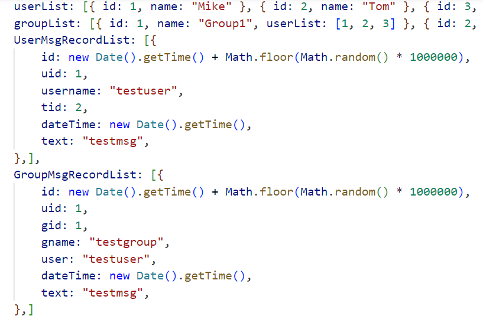

## Project Overview

This is a sample project of a chat application built using WebSocket for real-time communication. Users can engage in private and group chats, sending and receiving messages instantly.

### Attention
- **Very basic implementation**
- No database usage; data is stored directly in a dictionary list (in-memory) as shown below:
- Chat data will be cleared upon restarting the server.



### Key Features

- Private Chat: Users can select contacts for one-on-one private conversations, sending messages in real-time.
- Group Chat: Users can join groups and engage in group conversations with other members.
- Modify Username: Users can directly change their usernames within the interface.

### Technology Stack

- **Frontend Framework:** The project utilizes Vue.js as the frontend framework, with Element Plus for UI components.
- **WebSocket:** Real-time communication is achieved through WebSocket technology to ensure the immediacy of messages.
- **Backend:** The backend utilizes a WebSocket server for real-time data exchange between the frontend and backend.

### How to Run

1. Clone the project locally:

   ```bash
   git clone https://github.com/haostart/websocket-chat.git
   ```

2. Navigate to the project directory:

   ```bash
   cd yourproject
   ```

3. Install dependencies:

   ```bash
   npm install
   ```

   Start the project:
#### Client
   `
   npm run serve
   `
#### WebSocket Server
Navigate to the server folder and run

`npm run dev`

   The project will run locally, and you can access the application by visiting [http://localhost:8080](http://localhost:8080) in your browser.

### Project Structure

```
yourproject/
|-- src/
|   |-- components/
|   |   |-- ...  # Vue components
|   |-- assets/
|   |   |-- ...  # Static resources
|   |-- views/
|   |   |-- Home.vue  # Main view component
|   |-- App.vue
|   |-- main.js
|-- public/
|-- README.md
|-- ...
```

### Notes

1. Ensure that Node.js and npm are installed.
2. The WebSocket connection address in the project is `ws://127.0.0.1:9000`. Modify it based on your actual setup.